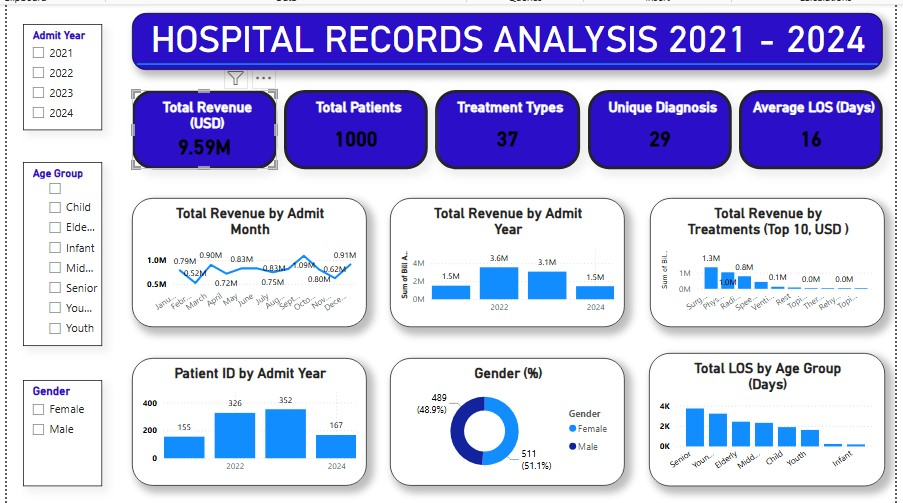

#  Hospital Records Analysis (2021 – 2024)

**Prepared by:** Ubong Solomon

---

## 1. Introduction

Hospitals generate large volumes of operational data every day — admissions, treatments, diagnoses, billing, and discharge records. When left unexamined, this data offers little value beyond day-to-day record-keeping. This project analyzes four years (2021–2024) of hospital records through an interactive Power BI dashboard, transforming raw admission and billing data into insights that support management decision-making around revenue performance, treatment demand, patient volume, and bed/resource utilization.

The goal of this report is to summarize the dashboard's findings in a structured format suitable for management review, and to translate the numbers into clear, actionable recommendations.

---

## 2. Data Description

The dataset underlying this dashboard covers hospital admissions recorded between **2021 and 2024**. Each record includes:

| Field | Description |
|---|---|
| Patient ID | Unique identifier per patient/admission |
| Admit Year / Month | Date of hospital admission |
| Age Group | Patient age category (Infant, Child, Youth, Young Adult, Middle-Aged, Elderly, Senior) |
| Gender | Male / Female |
| Treatment Type | Type of treatment/service received (37 distinct types) |
| Diagnosis | Diagnosis assigned (29 unique diagnoses) |
| Length of Stay (LOS) | Number of days admitted |
| Billing Amount (USD) | Revenue generated per record |

**Scope:** 1,000 patient records across a 4-year period, filterable by Admit Year, Age Group, and Gender.

---

## 3. Methodology

The analysis followed these steps:

1. **Data consolidation** – Admission, treatment, and billing records were combined into a single structured table.
2. **Data cleaning** – Records were checked for missing values, duplicate patient entries, and inconsistent category labels (e.g., treatment/diagnosis naming).
3. **Aggregation** – Revenue, patient counts, and length of stay were aggregated by year, month, treatment type, age group, and gender.
4. **Visualization** – Aggregated measures were built into an interactive Power BI dashboard using column charts, a line chart, a donut chart, and KPI cards, with slicers for Admit Year, Age Group, and Gender.
5. **Interpretation** – Patterns in the visualized data were reviewed to surface trends, anomalies, and areas warranting management attention.

**Tool used:** Power BI Desktop

---

## 4. Analysis and Findings
 

### 4.1 Overall Performance (2021–2024)

| Metric | Value |
|---|---|
| Total Revenue (USD) | **9.59M** |
| Total Patients | **1,000** |
| Treatment Types | **37** |
| Unique Diagnoses | **29** |
| Average Length of Stay (Days) | **16** |

### 4.2 Revenue by Admit Year
- 2021: **1.5M**
- 2022: **3.6M** (peak)
- 2023: **3.1M**
- 2024: **1.5M**

Revenue rose sharply from 2021 to 2022, then declined over the following two years, ending 2024 at the same level as 2021.

### 4.3 Patient Volume by Admit Year
- 2021: **155**
- 2022: **326**
- 2023: **352** (peak)
- 2024: **167**

Patient intake peaked in **2023**, a year after revenue peaked in 2022 — meaning the highest-volume year was not the highest-revenue year.

### 4.4 Revenue by Admit Month
Monthly revenue fluctuates across the year, with a notable high point in **July (1.09M)** and a low point in **March (0.52M)**, indicating some seasonality in admissions or billing.

### 4.5 Revenue by Treatment Type (Top 10)
**Surgery (1.3M)** and **Physiotherapy (0.8M)** are the two largest revenue contributors, followed at a distance by Radiology (0.4M) and smaller categories such as Speech Therapy, Ventilation, and Respiratory care.

### 4.6 Gender Distribution
- Male: **511 patients (51.1%)**
- Female: **489 patients (48.9%)**

The patient population is nearly evenly split by gender.

### 4.7 Length of Stay by Age Group
LOS is concentrated among **Senior** and **Young Adult** patients, and lowest among **Infant** and **Youth** groups — these two age groups place the greatest demand on bed capacity.

---

## 5. Key Insight

- **Revenue and patient volume are diverging.** Patient volume kept growing into 2023, but revenue had already peaked in 2022 and was falling — pointing to a decline in *revenue per patient* rather than a decline in demand.
- **Two treatment lines carry the hospital's revenue.** Surgery and Physiotherapy together account for the large majority of treatment revenue among the top 10 treatment types.
- **Senior and Young Adult patients drive bed occupancy.** These two groups account for the largest share of total length of stay, making them the primary lever for managing bed turnover.
- **2024 marks a downturn on both fronts.** Both revenue and patient volume fell sharply from 2023 to 2024, reversing the prior year's growth.
- **The patient base is gender-balanced**, so resourcing does not need to be skewed by gender.

---

## 6. Recommendation

1. **Investigate the revenue-per-patient decline** between 2022 and 2024 — review case mix, treatment pricing, and payer/insurance terms to identify what is suppressing revenue despite steady or rising patient counts.
2. **Protect and grow Surgery and Physiotherapy capacity** — these two service lines generate the majority of revenue and merit priority investment in staffing, equipment, and scheduling.
3. **Target discharge planning for Senior and Young Adult patients** — introduce step-down care or earlier discharge planning for these groups to ease bed pressure and reduce average LOS.
4. **Conduct a focused review of the 2024 downturn** — examine referral pipelines, seasonal effects, and any capacity constraints that may have contributed to the drop in both patients and revenue.
5. **Monitor monthly revenue seasonality** (e.g., the March low, July high) to better align staffing and budget planning with expected demand.

---

## 7. Conclusion

Between 2021 and 2024, the hospital treated 1,000 patients across 37 treatment types and 29 diagnoses, generating $9.59M in total revenue. While patient volume grew steadily through 2023, revenue peaked earlier in 2022 and declined thereafter — a gap that deserves management's attention. Surgery and Physiotherapy remain the hospital's core revenue drivers, and Senior and Young Adult patients are the primary drivers of bed occupancy through longer stays. The sharp downturn in both revenue and patient volume in 2024 is the single most urgent finding in this analysis and should be prioritized for further investigation. Acting on the recommendations above can help management stabilize revenue, optimize bed utilization, and prepare for more consistent performance going forward.

---

**Prepared by:** Ubong Solomon
